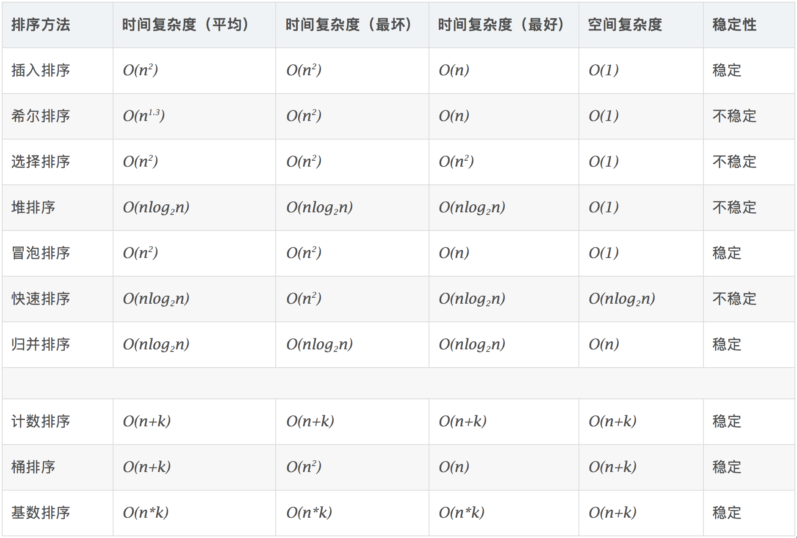

# 排序算法



## 快速排序

平均时间复杂度 $O(n\textrm{log}_2n)$ ，最坏时间复杂度 $O(n^2)$

主要思想：**分治**

1. 确定分界点 $x$ (它是数组中的某个数值)： $q[l]$ 或 $q[\frac{(l+r)}{2}]$ 或 $q[r]$ 或随机。
2. 调整区间：通过“调整”(*重点*)，让第一个区间里的所有数都小于等于 $x$ ，第二个区间里的所有数都大于等于 $x$  (注：分界点上的数不一定为 $x$ )。
3. 递归处理左右两段。

如上“调整”的普通样例步骤(时间复杂度 $O(n)$ )：

- Initialize $a[...]$, $b[...]$;
- For $q[l\sim r]$:
  - if $q[i]\leq x$: $a[.]\leftarrow x$;
  - if $p[i]> x$: $b[.]\leftarrow x$;
- $q[...]\leftarrow a[...]$; $q[...]\leftarrow b[...]$.

“调整”的高效步骤(双指针)：

- 使用两个指针，一个指向数组的开头，另一个指向数组的末尾。
- 从左指针开始，找到第一个大于等于基准元素的元素。
- 从右指针开始，找到第一个小于等于基准元素的元素。
- 如果左指针小于等于右指针，交换它们指向的元素，然后将左指针向右移动一位，右指针向左移动一位。
- 重复如上的三个步骤，直到左指针大于右指针。
- 现在，所有小于等于基准元素的元素都位于左边，所有大于等于基准元素的元素都位于右边。

以上的步骤涉及很多边界问题比较麻烦，建议直接记忆模板。

```C++
void quick_sort(int q[], int l, int r) {
  if (l >= r) return;

  int i = l - 1, j = r + 1, x = q[l + r >> 1];
  while (i < j) {
    do i++; while (q[i] < x);
    do j--; while (q[j] > x);
    if (i < j) swap(q[i], q[j]);
  }
  quick_sort(q, l, j), quick_sort(q, j + 1, r);
}
```

## 归并排序

平均和最坏时间复杂度均为 $O(n\textrm{log}_2n)$ 

主要思想：**分治**

以整个数组的中间点为分界，分为左边和右边。

1. 确定分界点(它是数组下标的中间值): $mid=\frac{(l+r)}{2}$。
2. 递归排序左边与右边。
3. *归并*(重点)：把两个有序的数组合并为一个有序的序列(“合二为一”，时间复杂度 $O(n)$ )。

关于“归并”步骤：

- 输入：两个有序的子数组。
- 创建一个空的结果数组，用于存储合并后的有序数组。
- 初始化两个子数组的索引，一个用于追踪左子数组，另一个用于追踪右子数组。
- 循环比较左右两个子数组的元素，并将较小的元素添加到结果数组中：
  - 如果左子数组的当前元素小于右子数组的当前元素，则将左子数组的元素添加到结果数组，并递增左子数组的索引。
  - 如果右子数组的当前元素小于左子数组的当前元素，则将右子数组的元素添加到结果数组，并递增右子数组的索引。
  - 如果两个子数组的当前元素相等，可以选择任意一个添加到结果数组。(一般将第一个子数组添加，使得归并排序“稳定”，而原始的快速排序是不稳定的)
- 重复上述比较和添加步骤，直到其中一个子数组的所有元素都添加到结果数组为止。
- 处理剩余的元素：
  - 如果左子数组还有剩余元素，将它们全部添加到结果数组中。
  - 如果右子数组还有剩余元素，将它们全部添加到结果数组中。

```C++
void merge_sort(int q[], int l, int r) {
  if (l >= r) return;

  int mid = l + r >> 1;
  merge_sort(q, l, mid);
  merge_sort(q, mid + 1, r);

  int k = 0, i = 1, j = mid + 1;
  while (i <= mid && j <= r) {
    if (q[i] <= q[j]) tmp[k++] = q[i++];
    else tmp[k++] = q[j++];
  }

  while (i <= mid) tmp[k++] = q[i++];
  while (j <= r) tmp[k++] = q[j++];

  for (i = l, j = 0; i <= r; i++, j++) q[i] = tmp[j];
}
```
