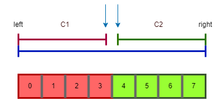

# 二分法

- [二分法](#二分法)
  - [整数二分(易错)](#整数二分易错)
    - [情况一：(如果mid属于左边)](#情况一如果mid属于左边)
    - [情况二：(如果mid属于右边)](#情况二如果mid属于右边)
    - [补充：整数二分的其他可用模板](#补充整数二分的其他可用模板)
      - [模板一](#模板一)
      - [模板二(推荐)](#模板二推荐)
  - [浮点数二分](#浮点数二分)

## 整数二分(易错)



满足单调性的数组一定可以使用二分查找，但可以使用二分查找的数组不一定需要满足单调性 (有单调性，一定能二分；没单调性，也有可能能二分)。

二分的本质是**边界**：只要找到某种*性质*(如：右半边满足，左半边不满足)，使得整个区间一分为二，那么就可以二分把分界点找到。

在上图中，条件 $C_1$ 和条件 $C_2$ 能够将数组一分为二。而图中绿色区域的左边界(索引4)和红色区域的右边界(索引3)都可以作为 $C_1$ 和 $C_2$ 的分界点，因此我们的整数二分查找模板也有两个，一个用来查找左边界(即右侧的分界点，索引4)，一个用来查找右边界(即左侧的分界点，索引3)。

为实现二分查找，我们需要确保每次缩小区间时答案都落在区间内。

[这篇博文](https://blog.csdn.net/raelum/article/details/128687109) 以及 [这篇](https://www.acwing.com/blog/content/19616/) 讲解得较好。

> 例题：[数的范围](./binary_search.cpp)

该例题的图解：


二分查找时间复杂度为 $O(\log n)$。

### 情况一：(如果mid属于左边)

**在右半段寻找左边界**(即寻找符合性质的第一个点)：因为查找的是绿色区域的左边界，所以先定义一个函数`check(i)`，其中参数 $i$ 是索引：

- 当 $i$ 位于绿色区域，即 $4\leqslant i \leqslant 7$ 时，`check(i)` 为真；
- 当 $i$ 位于红色区域，即 $0\leqslant i \leqslant 3$ 时，`check(i)`为假。

每次将区间划分为 $[l, mid]$ 和 $[mid + 1, r]$ ( $[l, mid]$ 是因为 $mid$ 点可能就是左边界，所以这里不用 $[l, mid - 1]$ )：

- $mid=\frac{l+r}{2}$;
- If (`check(mid)`是否满足绿色性质):
  - `True`：说明`mid`位于绿色区域，且`mid`有可能就是左边界；
    - 想要找到的点必然在 $[l, mid]$: $r\Leftarrow mid$
  - `False`：说明`mid`位于红色区域，且`mid`***必不可能是绿色区域的左边界***(因为`mid`最多是索引3)；
    - 想要找到的点必然在 $[mid+1, r]$: $l\Leftarrow mid+1$

代码模板：

```C++
bool check(int x) {/*检查x是否满足某种性质*/}

// 区间[l, r]被划分成[l, mid]和[mid + 1, r]时使用
//查找左边界 SearchLeft
int bsearch_1(int l, int r) {
    while (l < r) {
        int mid = l + r >> 1;
        if (check(mid)) r = mid;
        else l = mid + 1;
    }
    return l;
}
```

### 情况二：(如果mid属于右边)

**在左半段寻找右边界**(即寻找符合性质的最后一个点)：因为查找的是红色区域的右边界，所以先定义一个函数`check(i)`，设参数 $i$ 为索引：

- 当 $i$ 位于红色区域，即 $0\leqslant i \leqslant 3$ 时，`check(i)`为真；
- 当 $i$ 位于绿色区域，即 $4\leqslant i \leqslant 7$ 时，`check(i)`为假。

每次将区间划分为 $[l, mid - 1]$ 和 $[mid, r]$  (这是因为如果 $mid$ 点符合性质，那么下次划分右边界肯定从 $mid-1$ 开始)：

- $mid=\frac{l+r+1}{2}$;
- If (`check(mid)`是否满足红色性质):
  - `True`：说明`mid`位于红色区域，且`mid`有可能就是右边界；
    - 想要找到的点必然在 $[mid, r]$: $l\Leftarrow mid$
  - `False`：说明`mid`位于绿色区域，且`mid`***必不可能是红色区域的右边界***(因为`mid`最少是索引4)；
    - 想要找到的点必然在 $[l, mid-1]$: $r\Leftarrow mid-1$

$mid=\frac{l+r+1}{2}$ 的 $+1$ 是考虑到除法下取整。假设 $r=l+1$，如果还是取 $mid=\frac{l+r}{2}$ 的话，则有 $mid=\frac{2l+1}{2}=l$，这时更新`l = mid`时会出现`l = mid = l`的死循环(更新后的区间仍为 $[l,r]$)。 $+1$ 则相当于上取整，解决了这个隐患：取 $mid=\frac{l+r+1}{2}$，若`check(mid)`为真，则 $mid=r$，更新后的区间为 $[r,r]$，循环结束；若`check(mid)`为假，则更新后的区间为 $[l,l]$，循环结束。

代码模板：

```C++
bool check(int x) {/*检查x是否满足某种性质*/}

// 区间[l, r]被划分成[l, mid - 1]和[mid, r]时使用
//查找右边界 SearchRight
int bsearch_2(int l, int r) {
    while (l < r) {
        int mid = l + r + 1 >> 1; //需要+1 防止死循环
        if (check(mid)) l = mid;
        else r = mid - 1;
    }
    return l;
}
```

脚注：二分法求`mid = (l + r) / 2`的写法其实是不完善的，因为当`l`和`r`都特别大(接近`MAX int`)的时候 $mid$ 可能会溢出。所以， $mid$ 应该写成`mid = l + (r - l) / 2`，上取整为`mid = l + (r - l + 1) / 2`。

记忆：第一步先不管，先写上`mid = (l + r) / 2`，第二步再看是`l = mid`还是`r = mid`，如果是`l = mid`那就是上取整即要再加1，如果是`r = mid`则下取整 (加不加1完全取决于写的是`l = mid`，还是`r = mid`)。

### 补充：整数二分的其他可用模板

整数二分共有如下三类模板：


其中右边一列的模板不推荐使用。

#### 模板一

来源于[此页面](https://www.acwing.com/solution/content/83783/)。

代码模板：

```C++
const int N = 1e5+10;
int q[N];

int BS_left_border(int x) {
    int l = -1, r = n;
    while (l + 1 != r) {
        int mid = l + r >> 1;
        if (x > q[mid]) l = mid;
        else r = mid;
    }
    if (r == n || a[r] != x) return -1;

    return r;
}

int BS_right_border(int x) {
    int l = -1, r = n;
    while (l + 1 != r) {
        int mid = l + r >> 1;
        if (x < q[mid]) r = mid;
        else l = mid;
    }
    if (l == -1 || a[l] != x) return -1;
    
    return l;
}
```

#### 模板二(推荐)

来源于[此视频](https://www.bilibili.com/video/BV1bA41167Kb)。

以下模板适用于数组下标从0开始的情形：

```C++
int find_1(int q) {
    int l = -1, r = n;
    while (l + 1 < r) {
        int mid = l + r >> 1;
        if (array[mid] <= q) l = mid;
        else r = mid;
    }
    return l;
}

int find_2(int q) {
    int l = -1, r = n;
    while (l + 1 < r) {
        int mid = l + r >> 1;
        if (array[mid] >= q) r = mid;
        else l = mid;
    }
    return r;
}
```

注意上述模板可能需要判断数组下标是否越界。

下图所示模板适用于数组下标从1开始的情形：


## 浮点数二分

浮点数二分较为容易，它通常用来求某个数 $x$ 的近似值（ $x$ 不易直接求得，例如 $x=\sqrt{2}$ 等）。由于此时左右两个指针也均为浮点数，所以我们不能直接判断`l == r`，而是判断`r - l`是否小于预先设定的精度。

若要求精确到小数点后第 $k$ 位，则`eps`一般可取 $10^{-(k+2)}$。

> 例题：[数的三次方根](./binary_search_float.zh.md)

代码模板：

```C++
bool check(double x) {/*检查x是否满足某种性质*/}

double bsearch_3(double l, double r) {
    const double eps = 1e-6; // eps表示精度，取决于题目对精度的要求
    while (r - l > eps) {
        double mid = (l + r) / 2;
        if (check(mid)) r = mid;
        else l = mid;
    }
    return l;
}
```
