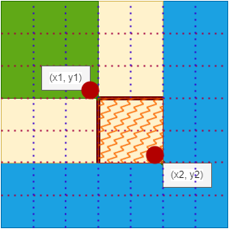

# 前缀和以及差分

## 前缀和

### 一维

原数组： $a_1,a_2,a_3,...,a_n$ (注意数组下标从**1**开始)

注：凡是涉及下标为 $i-1$ 的问题，建议下标从1开始

前缀和： $S_i=a_1+a_2+...+a_n, S_0=0$

如何求和： $S_i=S_{i-1}+a_i$

作用：求原数组中 $[l,r]$ 区间所有数的和，可用 $S_r-S_{l-1}$ 计算。

`S[i] = a[1] + a[2] + ... a[i], a[l] + ... + a[r] = S[r] - S[l - 1]`

### 二维



中间区域(也就是以 $(x_1,y_1)$ 为左上角， $(x_2,y_2)$ 为右下角的子矩阵)的面积： $S_{x_2,y_2}-S_{x_2,y_1-1}-S_{x_1-1,y_2}+S_{x_1-1,y_1-1}$

递推公式： $S_{i,j}=S_{i-1,j}+S_{i,j-1}-S_{i-1,j-1}+a_{i,j}$

```
S[i, j] = 第i行j列格子左上部分所有元素的和
以(x1, y1)为左上角，(x2, y2)为右下角的子矩阵的和为：
S[x2, y2] - S[x1 - 1, y2] - S[x2, y1 - 1] + S[x1 - 1, y1 - 1]
```

## 差分

前缀和的逆运算

### 一维差分

给定原数组 $a_1,a_2,...,a_n$ ，要求构造数组 $b_1,b_2,...,b_n$ ，使得 $a_i=b_1+b_2+...+b_i$ (即 $a$ 数组是 $b$ 数组的前缀和)，此时称 $b$ 数组是 $a$ 数组的**差分**。

构造方法是：

$$
b_1=a_1,
\\
b_2=a_2-a_1,
\\
b_3=a_3-a_2,
\\
\cdots 
\\
,b_n=a_n-a_{n-1}
$$

事实上可以不用考虑如何构造，只需考虑如何更新。

```
给A数组区间[l, r]中的每个数加上c：B[l] += c, B[r + 1] -= c
能让算法时间复杂度从O(n)变为O(1)
```

### 二维差分

给定原矩阵 $a_{ij}$ ，要求构造差分矩阵 $b_{ij}$ ，满足原矩阵是差分矩阵的二维前缀和。

```
给以(x1, y1)为左上角，(x2, y2)为右下角的子矩阵a中的所有元素加上c：
b[x1, y1] += c, b[x2 + 1, y1] -= c, b[x1, y2 + 1] -= c, b[x2 + 1, y2 + 1] += c
```
