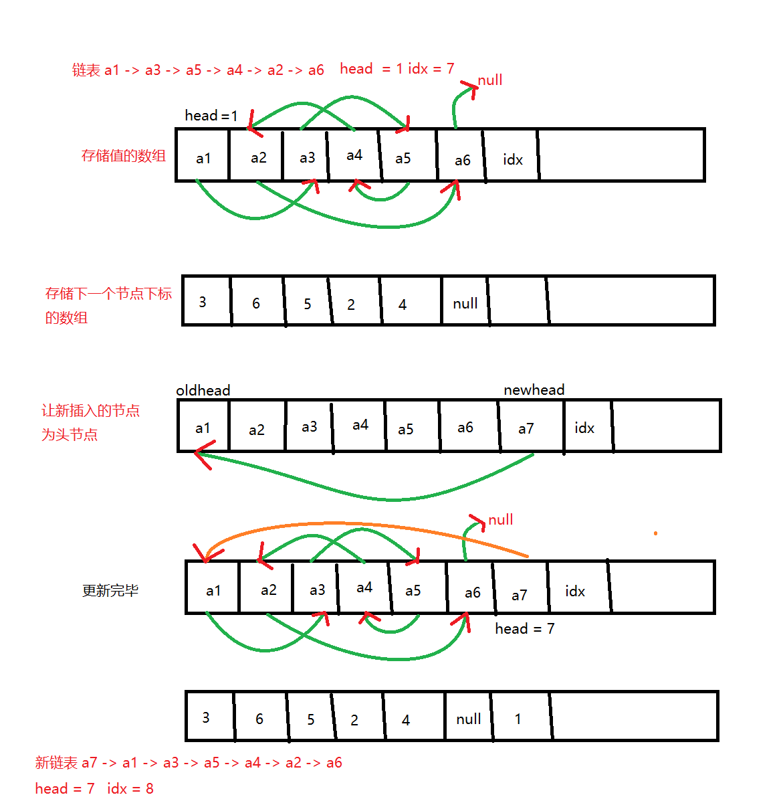

# 链表

这里主要涉及**数组模拟链表**的方法(比`new`快)，而非面试中常考的动态创建链表。

## 单链表

面试常考*邻接表*(其实就是一堆单链表)，邻接表最重要的应用是存储图和树。

单链表每个点都会存储`value`值和`next`指针。用数组模拟时，构建两个数组`e[N]`和`ne[N]`分别代表某一个点的当前值和`next`指针。空节点的下标用-1表示。



```C++
// head存储链表头，e[]存储节点的值
//ne[]存储节点的next指针，idx表示当前用到了哪个节点
int head, e[N], ne[N], idx;

// 初始化
void init() {
    head = -1;
    idx = 0;
}

// 在链表头插入一个数a
void insert(int a) {
    e[idx] = a, ne[idx] = head, head = idx++;
}

// 将头结点删除，需要保证头结点存在
void remove() {
    head = ne[head];
}
```

## 双链表

常用双链表优化某些问题。

为简化起见，可以不定义头节点、尾节点，而直接用0和1代表头和尾，所以最右边插入只要在指向1的那个点的右边插入就可以了

```C++
// e[]表示节点的值，l[]表示节点的左指针
//r[]表示节点的右指针，idx表示当前用到了哪个节点
int e[N], l[N], r[N], idx;

//初始化
void init() {
    //0是左端点，1是右端点
    r[0] = 1, l[1] = 0;
    idx = 2;
}

// 在节点a的右边插入一个数x
void insert(int a, int x) {
    e[idx] = x;
    l[idx] = a, r[idx] = r[a];
    l[r[a]] = idx, r[a] = idx++;
}

// 删除节点a
void remove(int a) {
    l[r[a]] = l[a];
    r[l[a]] = r[a];
}
```
