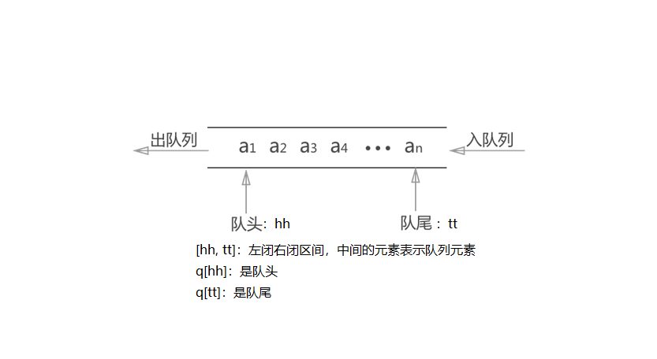

# 栈与队列

- [栈与队列](#栈与队列)
  - [栈](#栈)
    - [普通栈](#普通栈)
    - [单调栈](#单调栈)
  - [队列](#队列)
    - [普通队列](#普通队列)
    - [循环队列](#循环队列)
    - [单调队列](#单调队列)

## 栈

先进后出

### 普通栈

> 例题：[模拟栈](./stack_simulate.cpp)

```C++
// tt表示栈顶
int stk[N], tt = 0;

// 向栈顶插入一个数
stk[++tt] = x;

// 从栈顶弹出一个数
tt--;

// 栈顶的值
stk[tt];

// 判断栈是否为空，如果tt > 0，则表示不为空
if (tt > 0) {

}
```

### 单调栈

单调栈是栈的一种特殊形式，在栈中的元素必须满足单调性(一定是单调上升或单调下降等等的规律)。

常见应用：给定一个序列，求出序列中每一个元素的左边离它最近的比它小的数在什么地方，若不存在返回-1。

> 例题：[单调栈](./monotonic_stack.cpp)

既然我们必须让元素满足单调性，那么每次插入就和栈顶作比较。如果不满足某些性质，直接弹出栈顶，直到栈为空或满足该性质插入这个元素。

以`[3, 4, 2, 7, 5]`为例：


```C++
//常见模型：找出每个数左边离它最近的比它大/小的数
int tt = 0;
for (int i = 1; i <= n; i++) {
    while (tt && check(stk[tt], i)) tt--;
    stk[++tt] = i;
}
```

## 队列

先进先出

### 普通队列

用一个数组`q`保存数据。

用`hh`代表队头，`q[hh]`就是队头元素，`q[hh + 1]`就是第二个元素。

用`tt`代表队尾，`q[tt]`就是队尾元素，`q[tt + 1]`就是下一次入队，元素应该放的位置。

`[hh, tt]`左闭右闭，代表队列中元素所在的区间。

- 出队`pop`：因为`hh`代表队头，`[hh, tt]`代表元素所在区间，所以出队可以用`hh++`实现，`hh++`后，区间变为`[hh + 1, tt]`。
- 入队`push`：因为`tt`代表队尾，`[hh, tt]`代表元素所在区间，所以入队可以用`tt++`实现，`tt++`后，区间变为`[hh, tt + 1]`, 然后在`q[tt+1]`位置放入入队元素。
- 是否为空`empty`：`[hh, tt]`代表元素所在区间，当区间非空的时候，对列非空。也就是`tt >= hh`的时候，队列非空。
- 询问队头`query`：用`hh`代表队头，`q[hh]`就是队头元素，返回`q[hh]`即可。



> 例题：[模拟队列](./queue_simulate.cpp)

```C++
//在队尾插入元素。在队头弹出元素
int q[N], hh = 0, tt = -1;

//向队尾插入一个数x
q[++tt] = x;

//从队头弹出一个数
hh++;

//判断队列是否为空，如果hh <= tt，则表示不为空
if (hh <= tt) {/*not empty*/}
else {/*empty*/}

//访问队头元素的值
q[hh];

//访问队尾元素的值
q[tt];
```

### 循环队列

```C++
//hh表示队头，tt表示队尾的后一个位置
int q[N], hh = 0, tt = 0;

//向队尾插入一个数
q[tt++] = x;
if (tt == N) tt = 0;

//从队头弹出一个数
hh++;
if (hh == N) hh = 0;

//队头的值
q[hh];

//判断队列是否为空，如果hh != tt，则表示不为空
if (hh != tt) {

}
```

### 单调队列

单调队列的定义类似于单调栈：

- 单调递增队列：从队尾到队头单调递增；
- 单调递减队列：从队尾到队头单调递减。

例如对于单调递增队列，向其中插入元素的时候，为了维护队列的单调性，需要在保证将该元素插入到队尾后整个队列满足单调性的前提下弹出最少的元素(从队尾弹出)。可见严格意义上讲单调队列并不是队列，因为它不满足FIFO。

常见应用为滑动窗口：确定滑动窗口位于数组每个位置时，窗口中的最大值和最小值。

> 例题：[滑动窗口](./sliding_windows.cpp)

*以求最大值为例*：由于我们需要求出的是滑动窗口的最大值。如果当前的滑动窗口中有两个下标`i`和`j`，其中`i`在`j`的左侧`(i<j)`，并且`i`对应的元素不大于`j`对应的元素`(nums[i] <= nums[j])`，则当滑动窗口向右移动时，只要`i`还在窗口中，那么`j`一定也还在窗口中。这是由于`i`在`j`的左侧所保证的。***因此，由于`nums[j]`的存在，`nums[i]`一定不会是滑动窗口中的最大值了，我们可以将`nums[i]`永久地移除。***

因此我们可以使用一个队列存储所有还没有被移除的下标。在队列中，这些下标按照从小到大的顺序被存储，并且它们在数组`nums`中对应的值是严格单调递减的。当滑动窗口向右移动时，我们需要把一个新的元素放入队列中。为了保持队列的性质，我们会不断地将新的元素与队尾的元素相比较，如果新元素大于等于队尾元素，那么队尾的元素就可以被永久地移除，我们将其弹出队列。我们需要不断地进行此项操作，直到队列为空或者新的元素小于队尾的元素。由于队列中下标对应的元素是严格单调递减的，因此此时队首下标对应的元素就是滑动窗口中的最大值。窗口向右移动的时候，我们还需要不断从队首弹出元素保证队列中的所有元素都是窗口中的，因此当队头元素在窗口的左边的时候，弹出队头。

*以求最小值为例*：我们从左到右扫描整个序列，用一个队列来维护最近`k`个元素。如果用暴力来做，就是每次都遍历一遍队列中的所有元素，找出最小值即可，但这样时间复杂度就变成 $O(nk)$ 了。

然后我们可以发现一个性质：如果队列中存在两个元素，满足`a[i] >= a[j]`且`i < j`，那么无论在什么时候我们都不会取`a[i]`作为最小值了，所以可以直接将`a[i]`删掉；此时队列中剩下的元素严格单调递增，所以队头就是整个队列中的最小值，可以用 $O(1)$ 的时间找到；为了维护队列的这个性质，我们在往队尾插入元素之前，先将队尾大于等于当前数的元素全部弹出即可。这样所有数均只进队一次，出队一次，所以时间复杂度是 $O(n)$ 的。

```C++
//常见模型：找出滑动窗口中的最大值/最小值
int hh = 0, tt = -1;
for (int i = 0; i < n; i ++) {
    while (hh <= tt && check_out(q[hh])) hh++ ;  // 判断队头是否滑出窗口
    while (hh <= tt && check(q[tt], i)) tt-- ;
    q[++tt] = i;
}
```
