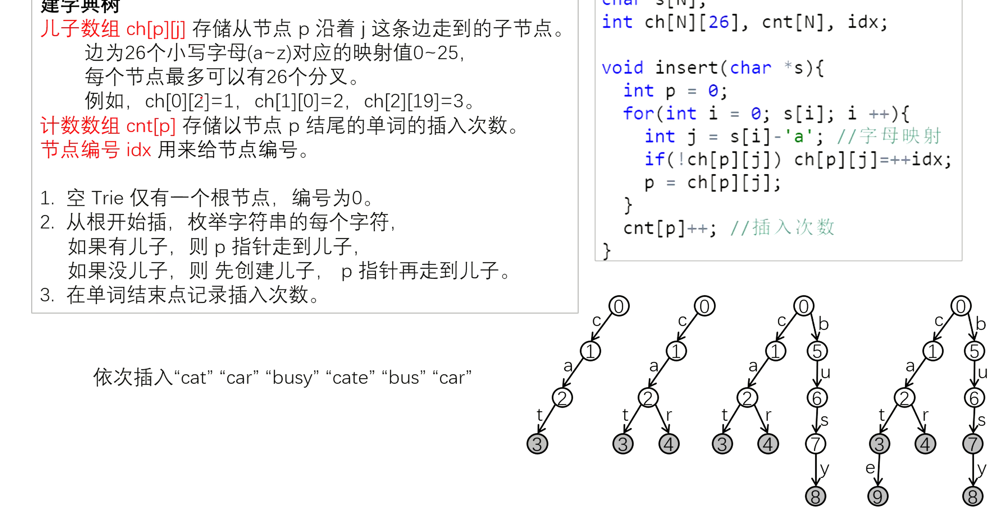

# Trie树

**Trie树**是用来高效地*存储*和*查找*字符串集合的数据结构，也叫**字典树**。

[这个视频](https://www.bilibili.com/video/BV1yA4y1Z74t)讲解得较好。

可以不管是链表，Trie树还是堆，他们的基本单元都是一个个节点连接构成的，可以成为“链”式结构。这个节点包含两个基本的属性：**本身的值**和**指向下一个节点的指针**。按道理，应该按照结构体的方式来实现这些数据结构的，但是做算法题一般用数组模拟，主要是因为比较快。原来这两个属性都是以结构体的方式联系在一起的，现在如果用数组模拟，如何才能把这两个属性联系起来从而区分各个节点呢？这就需要用到`idx`了。`idx`的操作总是`idx++`，这就保证了不同的`idx`值对应不同的节点，这样就可以利用`idx`把结构体内两个属性联系在一起了。因此，`idx`可以理解为节点。(参考自[此文章](https://www.acwing.com/solution/content/5673/))

> `idx`相当于一个**分配器**，如果需要加入新的节点就用`++idx`分配出一个下标。

Trie树中有个二维数组`son[N][26]`，表示当前节点的**儿子**，如果没有的话，可以等于`++idx`。Trie树本质上是一颗**多叉树**，对于字母而言最多有26个子节点。所以这个数组包含了两条信息。比如：`son[1][0]=2`表示1结点的一个值为`a`的子结点为节点2；如果`son[1][0] = 0`，则意味着没有值为`a`的子节点。这里的`son[N][26]`相当于链表中的`ne[N]`。计数数组`cnt[p]`存储以节点`p`结尾的单词的插入次数。



> 例题：[Trie字符串统计](./trie_statistics.cpp)

```C++
//son[父亲的位置][儿子的名字]=儿子的位置
int son[N][26], cnt[N], idx;
// 0号点既是根节点，又是空节点
// son[][]存储树中每个节点的子节点
// cnt[]存储以每个节点结尾的单词数量

// 插入一个字符串
void insert(char *str) {
    int p = 0;
    for (int i = 0; str[i]; i++) {
        int u = str[i] - 'a';
        if (!son[p][u]) son[p][u] = ++idx;
        p = son[p][u];
    }
    cnt[p]++;
}

// 查询字符串出现的次数
int query(char *str) {
    int p = 0;
    for (int i = 0; str[i]; i++) {
        int u = str[i] - 'a';
        if (!son[p][u]) return 0;
        p = son[p][u];
    }
    return cnt[p];
}
```

> 例题：[最大异或对](./max_xor.cpp)

一个整数，可以转化成为一个32位的二进制数，从而也就可以变成长度为32位的二进制字符串。那么我们可以每一次检索的时候,我们都走与当前 $A_i$ 这一位相反的位置走，也就是让`XOR`值最大，如果说没有路可以走的话，那么就走相同的路。因为这样就可以遍历所有的情况，对于每一个数字选择的都是前面和它异或产生的值最大的数字，即使当前数字是和后面的某个数字异或值最大，遍历后面那个数字的时候就会将这个数字选择出来。
