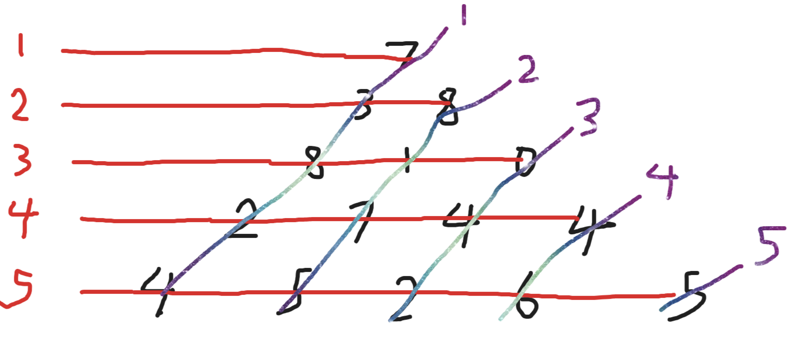

# 线性动态规划

## 数字三角形问题

> 例题：[数字三角形](./digital_triangle.cpp)

数字三角形动态规划问题：

- **状态表示**： $f(i,j)$：
  - ***集合***：所有从起点走到点 $(i,j)$ 的路径；
  - ***属性***：集合中所有路径对应的数字之和的最大值。
- **状态计算**：将集合 $f(i,j)$ 分为两类：
  - 来自左上方的路径： $f(i-1,j-1)+a[i][j]$；
  - 来自右上方的路径： $f(i-1,j)+a[i][j]$。

动态规划问题是时间复杂度一般为“状态数量”乘以“每个状态转移需要的计算量”，本题时间复杂度为 $O(n^2)$。

## 最长上升子序列问题

> 例题：[最长上升子序列](./longest_ascending_subsequence.cpp)

最长上升子序列动态规划问题：

- 状态表示： $f[i]$
  - 集合：所有以第 $i$ 个数结尾的上升子序列的集合
  - 属性：集合每个上升子序列的长度的最大值
- 状态计算：按倒数第二个数是哪个来划分集合，要么序列里只有一个数(0)，要么倒数第二个数的下标可能为 $1,2,\cdots ,n-1$，这些类不一定都存在

对于最后两个数分别为 $a_j,a_i$ 的上升子序列( $a_j < a_i$ )，满足其长度为 $f[j]+1$，则 $f[i]=\max (f[j]+1), a_j < a_i, j=0,1,\cdots ,i-1$

时间复杂度为 $O(n^2)$

> 例题：[最长上升子序列2](./longest_ascending_subsequence2.cpp)

当数据范围较大时，应该寻找一种时间复杂度更低的方式。

扩展解法可把时间复杂度降到 $O(n\log n)$

## 最长公共子序列问题

> 例题：[最长公共子序列](./longest_common_sequence.cpp)

最长公共子序列动态规划问题：

- 状态表示： $f(i,j)$
  - 集合：所有由第一个序列的前 $i$ 个字母和第二个序列的前 $j$ 个字母构成的公共子序列，也就是所有在第一个序列的前 $i$ 个字母中出现，且在第二个序列的前 $j$ 个字母中出现的子序列
  - 属性：所有这些子序列长度的最大值
- 状态计算：以`a[i]`、`b[j]`是否包含在子序列中来划分集合(共4种情况)
  - 情况 $00$ (不选`a[i]`，不选`b[j]`)： $f(i-1,j-1)$，一般代码中可以不写这种情况，因为 $f(i-1,j)$ 和 $f(i,j-1)$ 已经包含了这种情形
  - 情况 $01$ (不选`a[i]`，选`b[j]`)：注意 $f(i-1,j)$ 不一定包含`b[j]`(即情况 $01$ 为 $f(i-1,j)$ 的子集，而不是相等)，但为了求最大值，可以用 $f(i-1,j)$ 来替换，即使集合划分出现重复也没事(因为求的是最大值，只要不漏掉元素就行)
  - 情况 $10$ (选`a[i]`，不选`b[j]`)：为了求最大值，可以用 $f(i,j-1)$ 来替换
  - 情况 $11$ (选`a[i]`，选`b[j]`)： $f(i-1,j-1)+1$

时间复杂度为 $O(n^2)$

注：以上第二种情况指的是`a[i]`不出现在子序列中，`b[j]`一定出现在子序列中，`f[i - 1, j]`严格包含这种情况。为什么？
第二种状态的意思是：`a[i]`一定不在子序列中，且最后一个字母一定是`b[j]`；而`f[i - 1, j]`的意思是，`a`的前`i - 1`和`b`的前`j`中出现公共子序列，所以是第二种状态的条件更强。

- 为什么有重复？因为第二种状态更强，`f[i - 1, j]`条件弱一点，所以用`f[i - 1, j]`表示第二种状态里面肯定会有重复的；
- 为什么求最大值可以重复？如果取最大值的话，重复也就无所谓了，就算重复最大值依然是最大值。

## 编辑距离问题

> 例题：[最短编辑距离](./min_editing_distance.cpp)

该问题可进行如下分析：

- 状态表示：
  - 集合：所有将`a[1~i]`变为`b[1~j]`的操作方式
  - 属性：所有操作方式的操作次数的最小值
- 状态计算：`f[i,j]`
  - 删除：`f[i - 1, j] + 1`
  - 增加：`f[i, j - 1] + 1`
  - 修改：根据`a[i]`与`b[j]`是否相等来分类讨论，`f[i - 1, j - 1] + 1或0`

`f[i, j]`为以上三种情况最小值，时间复杂度为 $O(n^2)$

> 例题：[编辑距离](./editing_distance.cpp)
