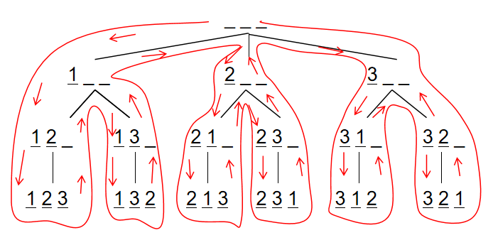

# 深度优先搜索和广度优先搜索

|     | 数据结构 | 空间   |
|-----|----------|--------|
| DFS | `stack`   | $O(h)$   |
| BFS | `queue`    | $O(2^h)$ |

空间上BFS占劣势，但BFS在搜索时有“最短路”的性质(若一个图所有边的权重均为`1`)，而DFS的路径不具有最短性。

动态规划是一种特殊的(没有环的)最短路问题。

## 深度优先搜索DFS

DFS需要考虑**回溯**和**剪枝**。

每个DFS对应一条搜索树，可以把DFS想象成一个“执着的人”。

> 例题：[排列数字](./permutations.cpp)



DFS需要把顺序想清楚。需要注意的是回溯一定要恢复现场，系统会为我们维护一条递归调用栈。

> 例题：[n-皇后问题方法一](./n_queens.cpp); [n-皇后问题方法二](./n_queens.cpp)


- `void dfs(int r)`: 深度优先遍历函数。参数`r`：从第`r`行开始放棋子，处理第`r`行。
- 递归结束判定：当`r == n`的时候，说明应该处理第`n`行了，也代表第`0 ~ n - 1`行放好棋子，也就是整个棋盘放好了棋子，也就是得到了一种解，也就是递归结束。
- 第`r`行，第`i`列能不能放棋子：用数组`dg udg cor`分别表示：点对应的两个斜线以及列上是否有皇后。
- `dg[i + r]`表示`r`行`i`列处，所在的对角线上有没有棋子，`udg[n - i + r]`表示`r`行`i`列处，所在的反对角线上有没有棋子，`cor[i]`表示第`i`列上有没有棋子。如果`r`行`i`列的对角线，反对角线上都没有棋子，即`!cor[i] && !dg[i + r] && !udg[n - i + r]`为真，则代表`r`行`i`列处可以放棋子。

剪枝就是判断当前方案非法，直接舍弃。

## 广度优先搜索BFS

注意：当所有边权为`1`时，才能用BFS求最短路。BFS通过队列存储和进行下一步的查找，叫做*换基迭代*，也就是本次的搜索方向是基于上一次的。它和动态规划中的后效性相似，本次的结果会影响下一次的结果。

- 将起点入队；
- 队首节点可拓展的点入队；如果没有可拓展的点，将队首节点出队；
  - 重复该步骤，直到到达目标位置或队列为空。

> 例题：[走迷宫](./walk_maze.cpp); [走迷宫STL方法一](./walk_maze_STL.cpp); [走迷宫STL方法二](./walk_maze_STL_2.cpp)

```
queue ← 初始状态
while (queue非空) {
    t ← 队头
    拓展t
}
```

> 例题：[八数码](./eight_numbers.cpp)
