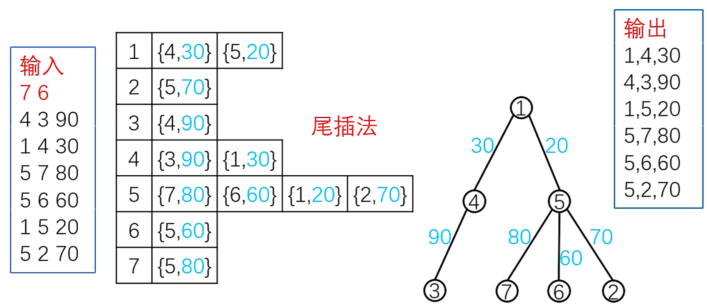
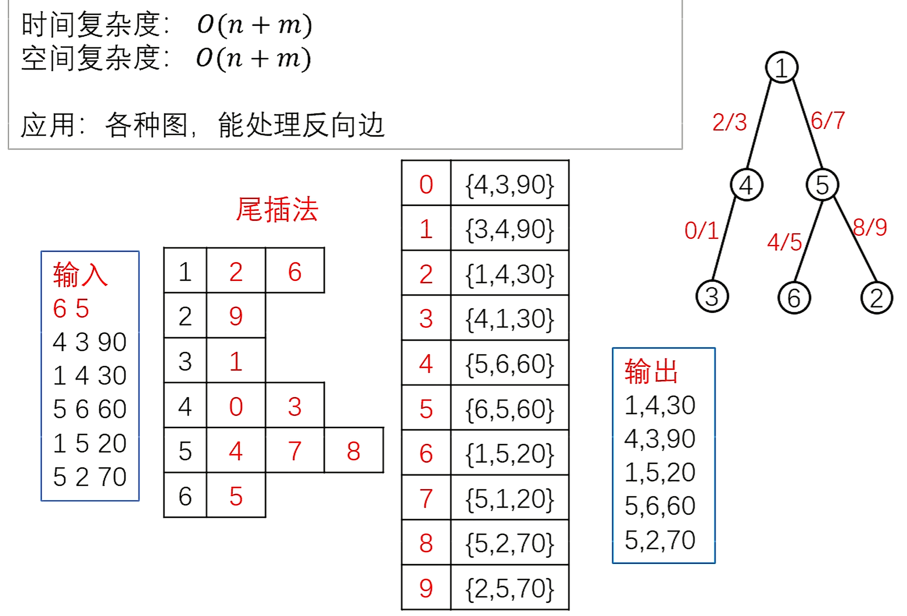
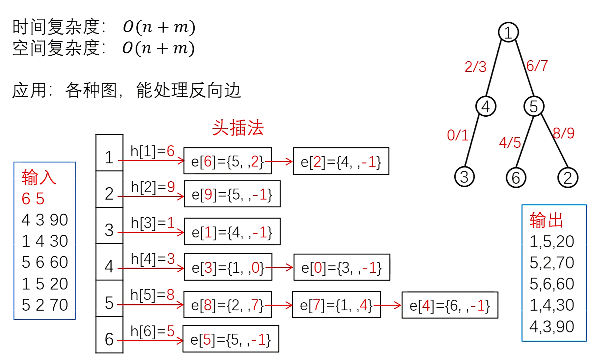

# 树和图的基本知识

- [树和图的基本知识](#树和图的基本知识)
  - [图的基本概念](#图的基本概念)
    - [简单图](#简单图)
    - [邻域](#邻域)
    - [度数](#度数)
    - [路径](#路径)
    - [连通](#连通)
  - [树和图的存储](#树和图的存储)
    - [邻接矩阵](#邻接矩阵)
    - [边集数组](#边集数组)
    - [邻接表](#邻接表)
    - [链式邻接表](#链式邻接表)
    - [链式前向星(重要)](#链式前向星重要)
  - [树和图的遍历](#树和图的遍历)
    - [深度优先遍历DFS](#深度优先遍历dfs)
    - [广度优先遍历BFS](#广度优先遍历bfs)

## 图的基本概念

树是一种特殊的图，树是无环连通图。

**图** $G$ 是一个二元组 $G=(V,E)$ 。其中 $V$ 是非空集，称为**点集**， $V$ 中的每个元素称为**顶点**或**节点**。 $E$ 为各节点之间边的集合，称为**边集**。图 $G$ 的点数 $|V|$ 称作 $G$ 的**阶**。

当 $V$ 和 $E$ 都是有限集合时，称 $G$ 为**有限图**。当 $V$ 或 $E$ 是无限集合时，称 $G$ 为**无限图**。

根据边是否有向可将图分为：**无向图**、**有向图**和**混合图**：

- **无向图**： $E$ 中的每个元素都是一个无序二元组 $(u,v)$，称作**无向边**，其中 $u,v\in V$。记 $e=(u,v)$，则 $u$ 和 $v$ 称为 $e$ 的**端点**；
- **有向图**： $E$ 中的每个元素都是一个有序二元组 $(u,v)$，有时也写作 $u\to v$，称作**有向边**或**弧**。记 $e=(u,v)$，称 $u$ 为 $e$ 的**起点**， $v$ 为 $e$ 的**终点**，起点和终点也称为 $e$ 的**端点**；
- **混合图**： $E$ 中既有有向边，又有无向边。

**图**主要分为*有向图*和*无向图*，无向图是一种特殊的有向图，无向图就是两点之间连着双方向边的有向图。对于无向图中的边 $ab$，存储两条有向边 $a\rightarrow b, b\rightarrow a$。因此我们可以只考虑有向图的存储。

若 $G$ 的每条边都被赋予一个数作为该边的权，则称 $G$ 为**赋权图**。如果这些权都是正实数，则称 $G$ 为**正权图**。

### 简单图

- **自环**：对 $E$ 中的边 $e=(u,v)$，若 $u=v$，则称 $e$ 是一个**自环**；
- **重边**：若存在 $e_1,e_2\in E$ 使得 $e_1=e_2$，则称它们是（一组）**重边**；
- **简单图**：若一个图中没有自环和重边，则它被称为**简单图**；
- **多重图**：图中存在自环或重边。

在无向图中 $(u,v)$ 和 $(v,u)$ 算一组重边，但在有向图中不算。

### 邻域

在无向图 $G=(V,E)$ 中，若对 $u,v\in V$，存在边 $(u,v)$，则称 $u$ 和 $v$ 是**相邻**的。

一个顶点 $v \in V$ 的**邻域**是所有与之相邻的顶点所构成的集合，记作 $N(v)$。一个点集 $S$ 的**邻域**定义如下：

$$
N\left( S \right) =\bigcup_{v\in S}{N\left( v \right)}
$$

### 度数

与一个顶点 $v$ 关联的边的条数称作该顶点的**度**，记作 $d(v)$。

对于无向简单图，有 $d(v)=|N(v)|$。根据 $d(v)$ 的取值可对图中的顶点进行分类：

$$
d\left( v \right) =\begin{cases}
	0, v\text{是孤立点}\\
	1, v\text{是叶节点}/\text{悬挂点}\\
	2k, v\text{是偶点}\\
	2k+1, v\text{是奇点}\\
	\left| V \right|-1, v\text{是支配点}\\
\end{cases}
$$

自环 $(v,v)$ 将对 $d(v)$ 产生 $2$ 的贡献。

对于图 $G$，所有节点的度数的最小值称为 $G$ 的**最小度**，记作 $\delta (G)$；最大值称为**最大度**，记作 $\Delta (G)$。即： $\Delta \left( G \right) =\max_{v\in G} d\left( v \right)$。若 $\delta(G)=\Delta(G)=k$，即图中每个顶点的度数都是一个固定的常数 $k$，则称 $G$ 为 $k$ −**正则图**。

***握手定理***（图论基本定理）：对任何无向图，由于每条边都会贡献两个度，所以：

$$
\sum_{v\in V}{d\left( v \right)}=2\left| E \right|
$$

下面考虑有向图。以一个顶点 $v$ 为起点的边的条数称为该顶点的**出度**，记作 $d^+(v)$。以一个顶点 $v$ 为终点的边的条数称为该节点的**入度**，记作 $d^-(v)$。显然 $d^+(v)+d^-(v)=d(v)$。由于每条边都会贡献一个出度和一个入度，所以：

$$
\sum_{v\in V}{d^+\left( v \right)}=\sum_{v\in V}{d^-\left( v \right)}=\left| E \right|
$$

### 路径

- **途径**：**途径**是连接一连串顶点的边的序列，可以为有限或无限长度。形式化地说，一条有限途径 $w$ 是一个边的序列 $e_1, e_2, \cdots, e_k$，使得存在一个顶点序列 $v_0, v_1, \cdots, v_k$ 满足 $e_i = (v_{i-1}, v_i)$ 。这样的途径可以简写为 $v_0 \to v_1 \to v_2 \to \cdots \to v_k$ 。通常来说，边的数量 $k$ 被称作这条途径的**长度** (如果边是带权的，长度通常指途径上的边权之和)。
- **迹**：对于一条途径 $w$，若 $e_1, e_2, \cdots, e_k$ 两两互不相同，则称 $w$ 是一条**迹**。
- **路径**：对于一条迹 $w$，若其连接的点的序列中点两两不同，则称 $w$ 是一条**路径**。

以上三者的区别在于：途径的边和顶点都可以重复；迹的边不能重复，但顶点可以重复；路径的边和顶点都不能重复。

- **回路**：对于一条迹 $w$，若 $v_0 = v_k$，则称 $w$ 是一条**回路**。
- **环** / **圈**：对于一条回路 $w$，若 $v_0 = v_k$ 是点序列中唯一重复出现的点对，则称 $w$ 是一个**环**。

关于路径的定义在不同地方可能有所不同，如，“路径”可能指本文中的“途径”，“环”可能指本文中的“回路”。

### 连通

对于一张无向图 $G = (V, E)$，对于 $u, v \in V$，若存在一条途径使得 $ v_0 = u, v_k = v$，则称 $u$ 和 $v$ 是**连通**的。由定义，任意一个顶点和自身连通，任意一条边的两个端点连通。

若无向图 $G$ 满足其中任意两个顶点均连通，则称 $G$ 是**连通图**， $G$ 的这一性质称作**连通性**。

若 $H$ 是 $G$ 的一个连通子图，且不存在 $F$ 满足 $H\subseteq F \subseteq G$ 且 $F$ 为连通图，则称 $H$ 是 $G$ 的一个**连通块** / **连通分量**。

对于一张有向图 $G = (V, E)$，对于 $u, v \in V$，若存在一条途径使得 $v_0 = u, v_k = v$，则称 $u$ **可达** $v$。由定义，任意一个顶点可达自身，任意一条边的起点可达终点。

若有向图 $G$ 满足其中任意两个顶点互相可达，则称 $G$ 是**强连通**的。若有向图 $G$ 的边替换为无向边后可以得到一张连通图，则称原来这张有向图是**弱连通**的。

类似可得**强连通分量**和**弱连通分量**的定义。

## 树和图的存储

图的输入格式通常为：第一行包含两个整数，分别是 $n$ 和 $m$，代表 $|V|$ 和 $|E|$。接下来 $m$ 行，每行包含三个整数，分别是 $a$， $b$ 和 $c$，代表起点，终点和边权。

### 邻接矩阵

**邻接矩阵**： $g[a,b]$ 存储边 $a \rightarrow b$，遍历整张图时间复杂度 $O(n^2)$ 且较费空间(空间复杂度为 $O(n^2)$ )。

### 边集数组

边集数组`e[i]`存储第`i`条边的起点`u`、终点`v`和边权`w`，时间复杂度为 $O(nm)$，空间复杂度为 $O(m)$。

```C++
struct edge {
    int u, v, w;
} e[M];  //边集
int vis[N];

void dfs(int u) {
    vis[u] = true;
    for (int i = 1; i <= m; i++) {
        if (e[i].u == u) {
            int v = e[i].v, w = e[i].w;
            printf("%d, %d, %d\n", u, v, w);
            if (!vis[v]) dfs(e[i].v);
        }
    }
}

int main() {
    cin >> n >> m;
    for (int i = 1; i <= m; i++) {
        cin >> a >> b >> c;
        e[i] = {a, b, c};
        //e[i] = {b, a, c};
    }
    dfs(1);
    return 0;
}
```

### 邻接表

**邻接表**：使用一个支持动态增加元素的数据结构构成的数组，如`vector<int> adj[N]`来存边，其中`adj[u]`存储的是点 $u$ 的所有出边的相关信息 (终点、边权等)。

```C++
vector<pair<int, int>> adj[N];

int main() {
    int n, m;
    cin >> n >> m;
    while (m--) {
        int a, b, c;
        cin >> a >> b >> c;
        adj[a].emplace_back(b, c);
    }
    return 0;
}
```

邻接表有很多种实现方式，我们还可以单独定义一个结构体或者开两个`vector<int>`型数组分别用来存储终点和边权。例如，我们用**出边数组**`e[u][i]`存储`u`点所有出边的终点`v`和边权`w`：

```C++
struct edge{
    int v, w;
};
vector<edge> e[N];  //边集

void dfs(int u, int father) {
    for (auto ed : e[u]) {
        int v = ed.v, w = ed.w;
        if (v == father) continue;
        printf("%d, %d, %d\n", u, v, w);
        dfs(v, u);
    }
}

int main() {
    cin >> n >> m;
    for (int i = 1; i <= m; i++) {
        cin >> a >> b >> c;
        e[a].push_back({b, c});
        e[b].push_back({a, c});
    }
    dfs(1, 0);
    return 0;
}
```



注意以上方法不能处理反向边。

复杂度分析：

- 查询是否存在 $u$ 到 $v$ 的边： $O(d^+(u))$；
- 遍历点 $u$ 的所有出边： $O(d^+(u))$；
- 遍历整张图： $O(n+m)$；
- 空间复杂度： $O(n+m)$。

### 链式邻接表

链式邻接表可以处理反向边。使用**边集数组**`e[i]`存储第`j`条边的起点`u`、终点`v`和边权`w`，**表头数组**`h[u][i]`存储`u`点的***所有***出边的编号。

```C++
struct edge {
    int u, v, w;
};
vector<edge> e; //边集
vector<int> h[N];  //点的所有出边

void add(int a, int b, int c) {
    e.push_back({a, b, c});
    h[a].push_back(e.size() - 1);
}

void dfs(int u, int father) {
    for (int i = 0; i < h[u].size(); i++) {
        int j = h[u][i];
        int v = e[j].v, w = e[j].w;
        if (v == father) continue;
        printf("%d, %d, %d\n", u, v, w);
        dfs(v, u);
    }
}

int main() {
    cin >> n >> m;
    for (int i = 1; i <= m; i++) {
        cin >> a >> b >> c;
        add(a, b, c);
        add(b, a, c);
    }
    dfs(1, 0);
    return 0;
}
```



### 链式前向星(重要)

之前的邻接表是基于`vector`来实现的，如果把`vector`换成用数组实现的链表，效率将会提高很多，而这样实现的邻接表又被称为**链式前向星**。邻接表类似哈希表的拉链法，每个点都有一个单链表，代表每个点可以走到哪个点，单链表内部点的次序无关紧要。

```C++
int h[N], e[N], ne[N], idx;
int w[N];  // 用来存储每条边的权重

// 向图中添加a到b的有向边，权重为c
void add(int a, int b, int c) {
    e[idx] = b, w[idx] = c, ne[idx] = h[a], h[a] = idx++;
}

int main() {
    memset(h, -1, sizeof(h));  // 使用链式前向星必须进行初始化

    int n, m;
    cin >> n >> m;
    while (m--) {
        int a, b, c;
        cin >> a >> b >> c;
        add(a, b, c);
    }

    return 0;
}
```

精炼的模板代码(无权)：

```C++
//对于每个点k，开一个单链表，存储k所有可以走到的点
//h[k]存储这个单链表的头结点
int h[N], e[M], ne[M], idx;

//添加一条边a->b
void add(int a, int b) {
    e[idx] = b, ne[idx] = h[a], h[a] = idx++;
}

//初始化
idx = 0;
memset(h, -1, sizeof h);
```

解析：

- `h[N]`: 表示第`i`个节点的第一条边的`idx`；
- `ne[M]`: 表示与第`idx`条边同起点的下一条边的`idx`；
- `e[M]`: 表示第`idx`条边的终点；
- `N`: 节点数量；
- `M`: 边的数量；
- `i`: 节点的下标索引；
- `idx`: 边的下标索引。

变量初始化定义：

```C++
int h[N], e[M], ne[M], idx;
```

当我们加入一条边的时候：

```C++
void add(int a, int b) {
    e[idx] = b;     // 记录加入的边的终点节点
    /*
    h[a]表示节点a为起点的第一条边的下标，
    ne[idx] = h[a]表示把h[a]这条边接在了idx这条边的后面，
    其实也就是把a节点的整条链表 接在了idx这条边后面；
    目的就是为了下一步把idx这条边当成a节点的单链表的第一条边，
    完成把最新的一条边插入到链表头的操作
    */
    ne[idx] = h[a];
    h[a] = idx++; //a节点开头的第一条边置为当前边，idx移动到下一条边
}
```

补充：带权图也可以利用`struct`来实现链式前向星(一个表头数组悬挂多个链表)，使用**边集数组**`e[i]`存储第`i`条出边的终点`v`、边权`w`和下一条边`ne`；使用**表头数组**`h[u]`存储`u`点的***第一条***出边的编号；**边的编号**`idx`可取`0,1,2,3...`等，注意越往后插的边越靠近`h`，这样的插入方法称为**头插法**(在`DFS`中，后插的先被访问)。

```C++
struct edge{
    int v, w, ne;
};
edge e[M];  //边集
int idx, h[N];  //点的第一条出边

void add(int a, int b, int c) {
    e[idx] = {b, c, h[a]};
    h[a] = idx++;
}

void dfs(int u, int father) {
    for (int i = h[u]; ~i; i = e[i].ne) {  //当走到-1时，-1取反就是0
        int v = e[i].v, w = e[i].w;
        if (v == father) continue;
        printf("%d, %d, %d\n", u, v, w);
        dfs(v, u);
    }
}

int main() {
    cin >> n >> m;
    memset(h, -1, sizeof h);
    for (int i = 1; i <= m; i++) {
        cin >> a >> b >> c;
        add(a, b, c);
        add(b, a, c);
    }
    dfs(1, 0);
    return 0;
}
```



## 树和图的遍历

分为深度优先遍历和广度优先遍历。

### 深度优先遍历DFS

> 例题：[树的重心](./tree_center.cpp)

**深度优先遍历**也叫**深度优先搜索** (Depth First Search)，遍历是手段，搜索是目的，通过遍历所有可能的情况以达到搜索的目的，因此「遍历」和「搜索」可以看作是两个的等价概念。

「一条路走到底，不撞南墙不回头」是对DFS的最直观描述。DFS最显著的特征在于其递归调用自身。DFS会对其访问过的点打上访问标记，在遍历图时跳过已打过标记的点，以确保每个点仅访问一次。

DFS的时间复杂度为 $O(n+m)$ ( $n$ 表示点数， $m$ 表示边数)，空间复杂度为 $O(n)$。

采用树的DFS可以知道每一个子树点的数量。

基本算法流程为：

```
1. Initialize all vertices as NOT_VISITED
2. Choose a starting vertex s
3. Call DFS_Visit(s)

DFS_Visit(u):
    1. Mark u as VISITED
    2. Perform any pre-processing or operations on u
    3. for each vertex v adjacent to u:
        3.1 if v is NOT_VISITED:
            3.1.1 DFS_Visit(v)
    4. Perform any post-processing or operations on u

```

伪代码为：

```SQL
-- u.color can be WHITE, GRAY, or BLACK, 
-- indicating whether a vertex is unvisited, currently being visited, or already visited, respectively
DFS(G):
    for each vertex u in G.V:
        u.color = WHITE
        u.π = NIL
    time = 0
    for each vertex u in G.V:
        if u.color == WHITE:
            DFS-VISIT(G, u)

DFS-VISIT(G, u):
    time = time + 1
    u.d = time
    u.color = GRAY
    for each v in G.Adj[u]:
        if v.color == WHITE:
            v.π = u
            DFS-VISIT(G, v)
    u.color = BLACK
    time = time + 1
    u.f = time
```

代码模板为：

```C++
int dfs(int u) {  //从节点u开始进行深度优先搜索
    st[u] = true;  //st[u]表示点u已经被遍历过 

    for (int i = h[u]; i != -1; i = ne[i]) {
        int v = e[i];
        if (!st[v]) dfs(v);
    }
}
```

### 广度优先遍历BFS

> 例题： [图中点的层次](./shortest_distance.cpp)

**广度优先遍历**（Breadth First Search）每次都尝试访问同一层的节点。 如果同一层都访问完了，再访问下一层。这样做的结果是，BFS算法找到的路径是从起点开始的最短合法路径。

算法过程可以看做是图上火苗传播的过程：最开始只有起点着火了，在每一时刻，有火的节点都向它相邻的所有节点传播火苗。

算法基本流程为：

```
1. Initialize all vertices as NOT_VISITED
2. Choose a starting vertex s
3. Mark s as VISITED
4. Enqueue s into a queue Q
5. while Q is not empty:
    5.1 u = Dequeue(Q)
    5.2 Perform any operations on u
    5.3 for each vertex v adjacent to u:
        5.3.1 if v is NOT_VISITED:
            5.3.1.1 Mark v as VISITED
            5.3.1.2 Enqueue v into Q
```

伪代码为：

```SQL
-- u.color can be WHITE, GRAY, or BLACK, 
-- indicating whether a vertex is unvisited, currently being visited, or already visited, respectively
BFS(G, s):
    for each vertex u in G.V - {s}:
        u.color = WHITE
        u.d = ∞
        u.π = NIL
    s.color = GRAY
    s.d = 0
    s.π = NIL
    Q = ∅
    ENQUEUE(Q, s)
    while Q ≠ ∅:
        u = DEQUEUE(Q)
        for each v in G.Adj[u]:
            if v.color == WHITE:
                v.color = GRAY
                v.d = u.d + 1
                v.π = u
                ENQUEUE(Q, v)
        u.color = BLACK
```

算法时间复杂度为 $O(n+m)$。

代码模板为：

```C++
void bfs(int u) {  //从节点u开始进行广度优先搜索
    queue<int> q;
    st[u] = true;  //表示u号点已经被遍历过
    q.push(u);

    while (q.size()) {  //也可写!q.empty()
        auto t = q.front();
        q.pop();

        for (int i = h[t]; i != -1; i = ne[i]) {
            int v = e[i];
            if (!st[v]) {
                st[v] = true;  // 表示点j已经被遍历过
                q.push(v);
            }
        }
    }
}
```

在BFS的过程中，也可以记录一些额外的信息。例如，我们可以开一个`d`数组用于记录起点到某个节点的最短距离，再开一个`p`数组记录是从哪个节点走到当前节点的。

```C++
void bfs(int u) {
    queue<int> q;
    st[u] = true;
    q.push(u);
    d[u] = 0, p[u] = -1;  // 假设节点的编号均为正整数

    while (!q.empty()) {
        auto t = q.front();
        q.pop();

        for (int i = h[t]; i != -1; i = ne[i]) {
            int v = e[i];
            if (!st[v]) {
                st[v] = true, q.push(v);
                d[v] = d[t] + 1, p[v] = t;
            }
        }
    }
}
```

假设路径终点是`x`，那么从`u`到`x`的最短路径长度就是`d[x]`，相应地，我们可以根据`p`数组还原出这条路径：

```C++
vector<int> restore(int x) {
    vector<int> path;
    for (int v = x; ~v; v = p[v])
        path.push_back(v);
    reverse(path.begin(), path.end());
    return path;
}
```

> 例题：[有向图的拓扑序列](./topological_sequence.cpp)

若一个由图中所有点构成的序列 $A$ 满足：对于图中的每条边 $(x,y)$， $x$ 在 $A$ 中都出现在y之前，则称 $A$ 是该图的一个 **拓扑序列**。

可以证明， ***有向无环图必存在拓扑序列***，因此有向无环图也被称为 **拓扑图**。如果有向图存在环，则不存在拓扑序列。拓扑序列可能不唯一。

有向图中入度为`0`的点可以作为拓扑序列的起点，将这些入度为`0`的点入队，再进行BFS。注意：一个有向无环图一定至少存在一个入度为`0`的点。寻找有向图的拓扑序列的伪代码为：

```C
queue <- 所有入度为0的点;

while (queue非空) {
    t <- 队头 并出队;
    枚举t的所有出边: t->j;
    删掉 t->j, j的入度: d[j]--;
    if (d[j] == 0) 
        让j入队: queue <- j;
}
```
