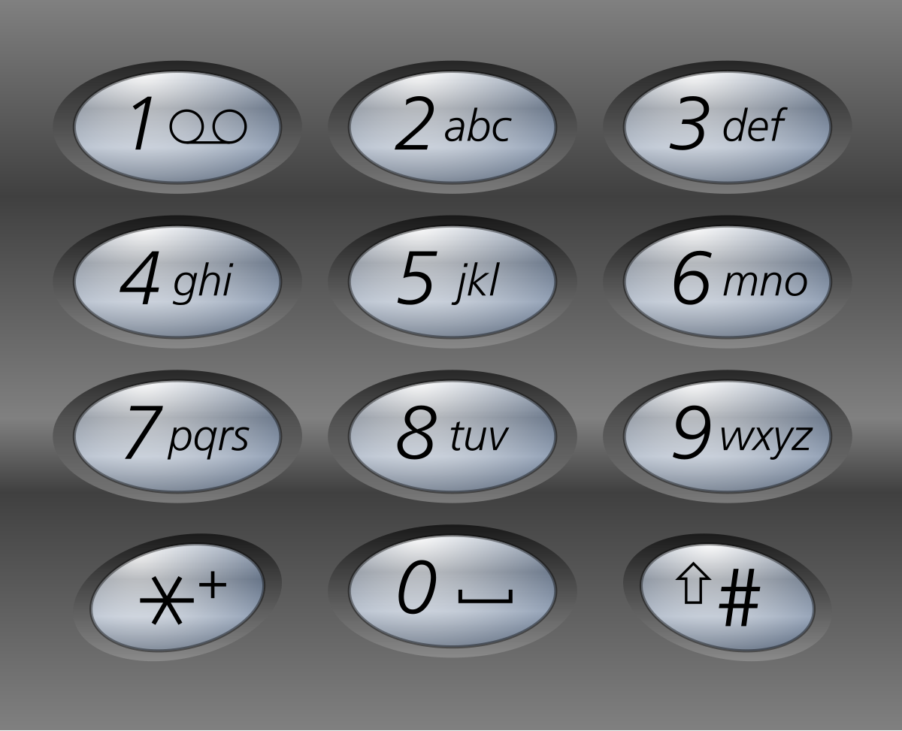

# Letter Combinations of a Phone Number

[Link](https://leetcode.com/problems/letter-combinations-of-a-phone-number/description/)

## Description

Given a string containing digits from `2-9` inclusive, return all possible letter combinations that the number could represent. Return the answer in any order.

A mapping of digits to letters (just like on the telephone buttons) is given below. Note that 1 does not map to any letters.



Example 1:

- Input: `digits = "23"`
- Output: `["ad","ae","af","bd","be","bf","cd","ce","cf"]`

Example 2:

- Input: `digits = ""`
- Output: `[]`

Example 3:

- Input: `digits = "2"`
- Output: `["a","b","c"]`

Constraints:

- `0 <= digits.length <= 4`
- `digits[i]` is a digit in the range `['2', '9']`.

## Solution

```C++
class Solution {
private:
    const string letterMap[10] = {
    "", // 0
    "", // 1
    "abc", // 2
    "def", // 3
    "ghi", // 4
    "jkl", // 5
    "mno", // 6
    "pqrs", // 7
    "tuv", // 8
    "wxyz" // 9
};
    vector<string> res;
    string path;
    void backtracking(string& digits, int index) {
        if (digits.length() == index) {
            res.push_back(path);
            return;
        }
        int digit = digits[index] - '0';
        string letters = letterMap[digit];
        for (int i = 0; i < letters.size(); i++) {
            path.push_back(letters[i]);
            backtracking(digits, index + 1);
            path.pop_back();
        }
    }
public:
    vector<string> letterCombinations(string digits) {
        if (digits.empty()) return res;
        backtracking(digits, 0);
        return res;
    }
};
```

- Time complexity: $O(3^m \times 4^n)$ , where $m$ is the number of digits corresponding to 4 letters, and $n$ is the number of digits corresponding to three letters;
- Space complexity: $O(3^m \times 4^n)$.

Another way of writing:

```C++
class Solution {
private:
    const string letterMap[10] = {
    "", // 0
    "", // 1
    "abc", // 2
    "def", // 3
    "ghi", // 4
    "jkl", // 5
    "mno", // 6
    "pqrs", // 7
    "tuv", // 8
    "wxyz" // 9
};
    vector<string> res;
    void backtracking(const string& digits, int index, const string& path) {
        if (digits.length() == index) {
            res.push_back(path);
            return;
        }

        int digit = digits[index] - '0';
        string letters = letterMap[digit];
        for (int i = 0; i < letters.size(); i++)
            backtracking(digits, index + 1, path + letters[i]);

        // the 4-line code above can be changed into:
        // for (auto letter : letterMap[digits[index] - '0'])
        //     backtracking(digits, index + 1, path + letter);
    }
public:
    vector<string> letterCombinations(string digits) {
        if (digits.empty()) return res;
        backtracking(digits, 0, "");
        return res;
    }
};
```
