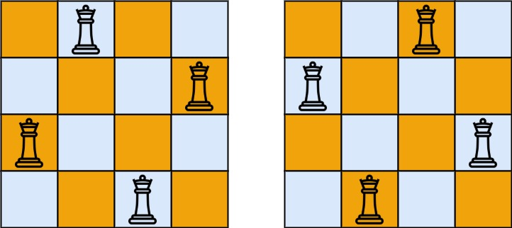

# N-Queens

[Link](https://leetcode.com/problems/n-queens/description/)

## Description

The **n-queens** puzzle is the problem of placing `n` queens on an `n x n` chessboard such that no two queens attack each other.

Given an integer `n`, return all distinct solutions to the n-queens puzzle. You may return the answer in any order.

Each solution contains a distinct board configuration of the n-queens' placement, where `'Q'` and `'.'` both indicate a queen and an empty space, respectively.

Example 1:



- Input: `n = 4`
- Output: `[[".Q..","...Q","Q...","..Q."],["..Q.","Q...","...Q",".Q.."]]`
- Explanation: There exist two distinct solutions to the `4`-queens puzzle as shown above

Example 2:

- Input: n = 1
- Output: [["Q"]]

Constraints:

- `1 <= n <= 9`

## Solution

### Way 1

```C++
class Solution {
private:
    vector<vector<string>> res;
    void backtracking(vector<string>& board, int n, int row) {
        if (row == n) {
            res.push_back(board);
            return;
        }

        for (int col = 0; col < n; col++) {
            if (!isValid(row, col, board, n)) continue;
            board[row][col] = 'Q';
            backtracking(board, n, row + 1);
            board[row][col] = '.';
        }
    }

    bool isValid(int row, int col, vector<string>& board, int n) {
        for (int i = 0; i < row; i++) {
            if (board[i][col] == 'Q') return false;
        }
        for (int i = row - 1, j = col - 1; i >= 0 && j >= 0; i--, j--) {
            if (board[i][j] == 'Q') return false;
        }
        for (int i = row - 1, j = col + 1; i >= 0 && j < n; i--, j++) {
            if (board[i][j] == 'Q') return false;
        }
        return true;
    }
public:
    vector<vector<string>> solveNQueens(int n) {
        vector<string> board(n, string(n, '.'));
        backtracking(board, n, 0);
        return res;
    }
};
```

### Way 2

```C++
class Solution {
private:
    int sizeBoard;
    vector<bool> column, lDiagonal, rDiagonal;
    vector<vector<string>> res;
    vector<string> path;
    void backtracking(int index) {
        // Base case: if all queens are placed
        if (index == sizeBoard) {
            res.push_back(path);  // Add the current board configuration to the result
            return;
        }

        // Trying to place a queen in each column of the current row
        for (int j = 0; j < sizeBoard; j++) {
            // Check if the current column, left diagonal, and right diagonal are safe
            if (column[j] || lDiagonal[index + j] || rDiagonal[sizeBoard - index + j]) continue;

            // Place the queen and mark the column, left diagonal, and right diagonal as occupied
            column[j] = lDiagonal[index + j] = rDiagonal[sizeBoard - index + j] = true;
            path[index][j] = 'Q';

            // Move to the next row
            backtracking(index + 1);

            // Backtrack: remove the queen and unmark the column, left diagonal, and right diagonal
            path[index][j] = '.';
            column[j] = lDiagonal[index + j] = rDiagonal[sizeBoard - index + j] = false;
        }
    }
public:
    vector<vector<string>> solveNQueens(int n) {
        sizeBoard = n;
        column = vector<bool>(sizeBoard, false);
        lDiagonal = rDiagonal = vector<bool>(2 * sizeBoard, false);
        path = vector<string>(sizeBoard, string(sizeBoard, '.'));
        
        backtracking(0);  // Start backtracking from the first row
        
        return res;
    }
};
```

***Understanding the Safe Spot Determination***:

In the N-Queens problem, a spot (or cell) on the board is considered "safe" if no other queen can attack the queen placed on that spot. Note that a queen in chess can move vertically, horizontally, and diagonally over any number of unoccupied squares. Therefore, a spot is safe if:

1. **No Other Queen in the Same Column**: Since a queen can attack any square in her column, we must ensure that no other queen is placed in the same column.
2. **No Other Queen in the Same Diagonals**: A queen can also attack any square on the diagonals originating from her position. This includes both left and right diagonals.

To efficiently check these conditions, the solution uses three arrays: `column`, `lDiagonal`, and `rDiagonal`.

- **`column` Array**: Tracks whether a column is occupied by a queen.
- **`lDiagonal` and `rDiagonal` Arrays**: Track the diagonals. Diagonals are a bit trickier to handle. Each diagonal can be uniquely identified by a particular property:
    - **Right ( $\searrow$ ) Diagonals**: On these diagonals, the row index minus the column index (`row - column`) is constant.
    - **Left ( $\swarrow$ ) Diagonals**: Here, the row index plus the column index (`row + column`) is constant.

However, to use arrays efficiently and avoid negative indices for left diagonals, an offset is added. That's why for right diagonals, we use `sizeBoard - index + j` to keep indices positive and within the array bounds.

***Execution of the Solution***:

1. **Initialization**: When `solveNQueens` is called, it initializes all necessary arrays and variables. The `path` array is initialized to represent an empty N×N chessboard.
2. **Recursive Backtracking**: The function `backtracking` is called starting from the first row (index 0).
3. **Placing a Queen**: For each row, the algorithm iterates through each column (`j`) and checks if placing a queen there is safe:
    - It checks `column[j]`, `lDiagonal[index + j]`, and `rDiagonal[sizeBoard - index + j]`. If any of these are `true`, it means the corresponding column or diagonal is already occupied by another queen, and it moves to the next column.
4. **Marking the Board**: If a safe spot is found, the algorithm places a queen there (`path[index][j] = 'Q'`) and marks the column and diagonals as occupied.
5. **Recursion to Next Row**: After placing a queen, the algorithm recursively calls `backtracking` for the next row (`index + 1`).
6. **Backtracking**: If it turns out that no further queens can be placed, or after successfully placing all queens, the function backtracks:
    - It removes the queen from the current cell (`path[index][j] = '.'`).
    - It unmarks the column and diagonals.
    - The loop then continues to try the next column in the current row.
7. **Adding to Result**: Once a queen is successfully placed in the last row (base case), the current board configuration (`path`) is added to the results (`res`).

***Complexity***:

- Time Complexity: Worst-Case Time Complexity is $O(N!)$
    - In the worst case, the algorithm tries to place a queen in each column of each row. The number of possibilities decreases with each level of recursion, leading to $N!$ (factorial) as the upper bound.
- Space Complexity: Space Complexity is $O(N)$
    - The space complexity is linear due to the storage of the board state and the recursive call stack. The board state requires $O(N)$ space, and the maximum depth of the recursive call stack is $N$.


