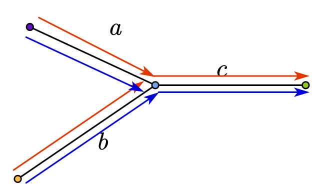

# Intersection of Two Linked Lists

[Link](https://leetcode.com/problems/intersection-of-two-linked-lists/description/)

## Description

Given the heads of two singly linked-lists `headA` and `headB`, return the node at which the two lists intersect. If the two linked lists have no intersection at all, return `null`.

The test cases are generated such that there are no cycles anywhere in the entire linked structure.

Note that the linked lists must retain their original structure after the function returns.

Custom Judge:

The inputs to the judge are given as follows (your program is not given these inputs):

- `intersectVal` - The value of the node where the intersection occurs. This is `0` if there is no intersected node.
- `listA` - The first linked list.
- `listB` - The second linked list.
- `skipA` - The number of nodes to skip ahead in `listA` (starting from the head) to get to the intersected node.
- `skipB` - The number of nodes to skip ahead in `listB` (starting from the head) to get to the intersected node.

The judge will then create the linked structure based on these inputs and pass the two heads, headA and headB to your program. If you correctly return the intersected node, then your solution will be accepted.

Example 1:

- Input: `intersectVal = 8, listA = [4,1,8,4,5], listB = [5,6,1,8,4,5], skipA = 2, skipB = 3`
- Output: Intersected at '8'
- Explanation:
  - The intersected node's value is 8 (note that this must not be 0 if the two lists intersect). From the head of A, it reads as `[4,1,8,4,5]`. From the head of B, it reads as `[5,6,1,8,4,5]`. There are 2 nodes before the intersected node in A; There are 3 nodes before the intersected node in B.
  - Note that the intersected node's value is not 1 because the nodes with value 1 in A and B (2nd node in A and 3rd node in B) are different node references. In other words, they point to two different locations in memory, while the nodes with value 8 in A and B (3rd node in A and 4th node in B) point to the same location in memory.

Example 2:

- Input: `intersectVal = 2, listA = [1,9,1,2,4], listB = [3,2,4], skipA = 3, skipB = 1`
- Output: Intersected at '2'
- Explanation:
  - The intersected node's value is 2 (note that this must not be 0 if the two lists intersect).
  - From the head of A, it reads as `[1,9,1,2,4]`. From the head of B, it reads as `[3,2,4]`. There are 3 nodes before the intersected node in A; There are 1 node before the intersected node in B.

Example 3:

- Input: `intersectVal = 0, listA = [2,6,4], listB = [1,5], skipA = 3, skipB = 2`
- Output: No intersection
- Explanation:
  - From the head of A, it reads as `[2,6,4]`. From the head of B, it reads as `[1,5]`. Since the two lists do not intersect, intersectVal must be 0, while skipA and skipB can be arbitrary values.
  - Explanation: The two lists do not intersect, so return null.

Constraints:

- The number of nodes of `listA` is in the `m`.
- The number of nodes of `listB` is in the `n`.
- `1 <= m, n <= 3 * 10^4`
- `1 <= Node.val <= 10^5`
- `0 <= skipA < m`
- `0 <= skipB < n`
- `intersectVal` is `0` if `listA` and `listB` do not intersect.
- `intersectVal == listA[skipA] == listB[skipB]` if `listA` and `listB` intersect.

## Solution

### Classical Solution

1. Given two linked lists, `currA` points to the head of list A and `currB` points to the head of list B.
2. We find the lengths of the two lists, and the difference between the two lists, and then we move `currA` to a position where it is aligned with the end of `currB`.
3. At this point we can compare `currA` and `currB` to see if they are the same, if they are not the same, we move `currA` and `currB` backward at the same time, and if we encounter `currA == currB`, then we find the intersection point.
4. Otherwise, the loop exits and returns the null pointer.

```C++
// Definition for singly-linked list.
/**
 * Definition for singly-linked list.
 * struct ListNode {
 *     int val;
 *     ListNode *next;
 *     ListNode(int x) : val(x), next(NULL) {}
 * };
 */

class Solution {
public:
    ListNode *getIntersectionNode(ListNode *headA, ListNode *headB) {
        // Initialize pointers for traversing both lists
        ListNode *currA = headA;
        ListNode *currB = headB;

        // Variables to store the lengths of both lists
        int lenA = 0, lenB = 0;
        // Calculate the length of list A
        while (currA) {
            lenA++;
            currA = currA->next;
        }
        // Calculate the length of list B
        while (currB) {
            lenB++;
            currB = currB->next;
        }

        // Reset the pointers to the heads of the lists
        currA = headA;
        currB = headB;

        // NOTE: Ensure that currA points to the longer list
        if (lenB > lenA) {
            swap(lenA, lenB);
            swap(currA, currB);
        }

        // Calculate the difference in lengths
        int gap = lenA - lenB;
        // Advance the pointer in the longer list by the difference in lengths
        while (gap--) {
            currA = currA->next;
        }

        // Traverse both lists in tandem until an intersection is found or end of lists is reached
        while (currA) {
            if (currA == currB) {
                return currA; // Intersection node found
            }
            currA = currA->next;
            currB = currB->next;
        }

        // No intersection found
        return nullptr;
    }
};
```

If one list is longer than the other, the algorithm advances the pointer in the longer list by the difference in lengths. This ensures that when you traverse both lists in the following steps, you traverse an equal number of nodes until the end of the lists.

- Time complexity: $O(n+m)$;
- Space complexity: $O(1)$.

### More Elegant Way

Algorithm steps:

- Scan with two pointers starting at the head of each of the two linked lists, taking one step each time;
- If the pointers go to `null`, start from the head of the other linked table;
- When the two pointers are the same:
  - If the pointer is not `null`, the pointer position is the meeting point;
  - If the pointer is `null`, the two linked lists do not intersect.

```C++
/**
 * Definition for singly-linked list.
 * struct ListNode {
 *     int val;
 *     ListNode *next;
 *     ListNode(int x) : val(x), next(NULL) {}
 * };
 */
class Solution {
public:
    ListNode *getIntersectionNode(ListNode *headA, ListNode *headB) {
        auto p = headA, q = headB;
        while (p != q) {
            p = p ? p->next : headB;
            q = q ? q->next : headA;
        }
        return p;
    }
};
```



Code with comments:

```C++
class Solution {
public:
    ListNode *getIntersectionNode(ListNode *headA, ListNode *headB) {
        // Initialize two pointers, p and q, for each list
        auto p = headA, q = headB;

        // Continue looping until both pointers either meet or reach the end (nullptr)
        while (p != q) {
            // Move p to the next node in list A, or to the head of list B if it reaches the end
            p = p ? p->next : headB;
            // Move q to the next node in list B, or to the head of list A if it reaches the end
            q = q ? q->next : headA;
        }
        // When p and q meet, it's the intersection node or nullptr if there's no intersection
        return p;
    }
};
```
